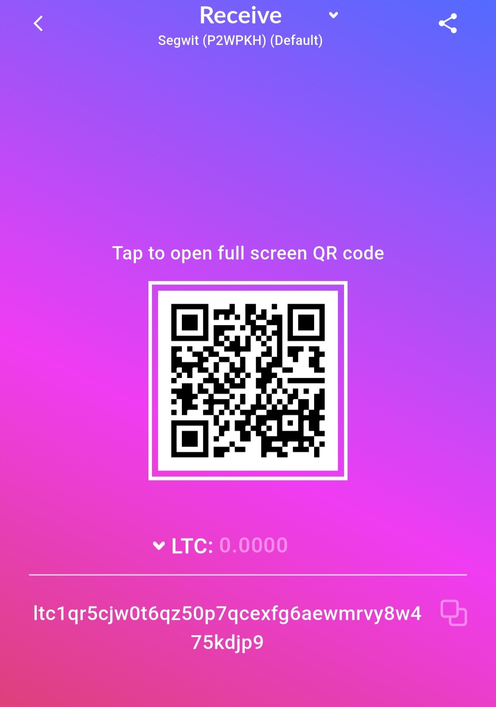

# Geist
The ultimate music selfbot
---

---

## 🧠 Notes

- The bot **does not join voice channels**
- Sends audio **only as a file message**
- Audio is encoded in **MP3 (192 kbps)** using `yt-dlp` + FFmpeg
- Designed for **private server testing** or automation practice

---

## 📜 License & Use Policy

This code is **open-source** under an educational-use clause:

- ✅ **Personal / educational use** is allowed
- ❌ **Commercial, malicious, or ToS-breaking use** is **not endorsed**
- ❌ Do **not** impersonate others or disrupt servers using this

If you fork this project publicly or modify it, consider linking back to the original repository to give credit.

---

## 💸 Donate (Litecoin)

If you found this helpful and want to support future work:

**Litecoin (LTC) Address: ltc1qr5cjw0t6qz50p7qcexfg6aewmrvy8w475kdjp9 **

  

